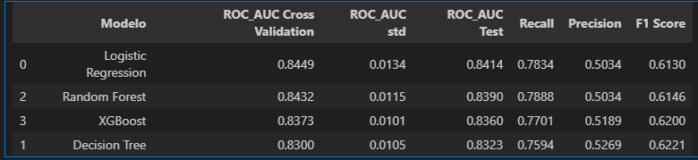
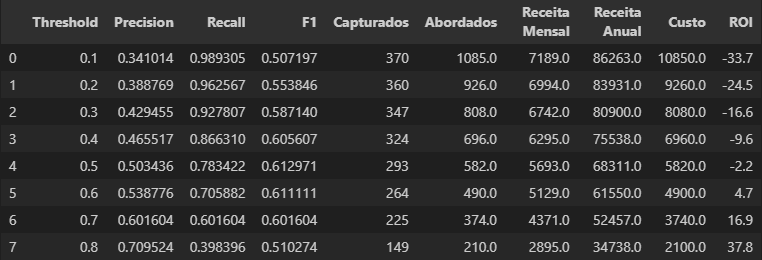
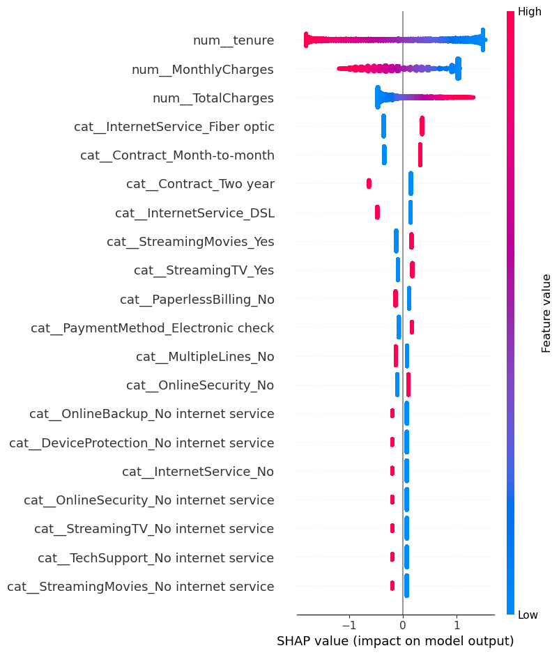

# Analise de Churn com dataset Telco Customer Churn
Projeto de ciência de dados para previsão de Churn

## Objetivo
O objetivo deste projeto é identificar os principais motivos de Churn de um cliente e criar planos de ação para antecipar este evento, utilizando de técnicas estatisticas e Machine Learning.

## Dataset
Para este projeto, foi utilizado o dataset Telco Customer Churn do Kaggle (https://www.kaggle.com/datasets/blastchar/telco-customer-churn)

O dataset possui 7043 registros, contendo informações do ciclo de vida do cliente na empresa.
Contém informações como tempo de relacionamento, valor gasto por mês e gasto total, serviços adicionais contratados, etc.

## Estrutura do projeto
customer_churn_analysis/

├── data/
│   └── raw/
│   
│
├── notebooks/
│   ├── 01 - EDA.ipynb
│   ├── 02 - model_evaluate.ipynb
│   ├── 03 - analysis.ipynb
│   └── 04 - shap_interpretability.ipynb
│
├── src/
│   ├── data/
│   ├── features/
│   ├── models/
│   └── utils/
│
└── README.md

## Principais Etapas

1. Analise Exploratória (EDA)
2. Tratamento de Dados
3. Feature Engeneering
4. Modelagem
5. Avaliação de Métricas
6. Interpretação do modelo
7. Analises de Impacto Financeiro

## Principais Insights
Clientes com maior risco de Churn:
- Possuem menor tempo de relacionamento e valor de pagamento maior;
- Clientes com contratos curtos (Month-to-Month);
- Ausencia de serviços adicionais;
- Cobrança eletronica, como cheque eletronico e "paperless bills"

## Modelagem

### Modelos Testados:

- Logistic Regression
- Decision Tree
- Random Forest
- XGBoost

### Metricas comparadas 

O modelo escolhido foi o de Logistic Regression pelos seguintes motivos:

- Recall e ROC-AUC com valores alto;
- Maior facilidade de interpretação;
- Modelagem simples;

Tabela comparativa entre modelos

Mesmo realizando o Cross Validation, verificou-se que os valores de ROC-AUC não alteraram de forma drastica, com um desvio padrão baixo de 0.013, o que mostra que o modelo possui boa estabilidade, não "overfittando" em cima da amostra teste.

### Threshold

Após o comparativo de métricas, foi feito um teste com diferentes Thresholds para verificar se o modelo está sendo agressivo ou conservador demais em relação ao corte.
Um dos critérios levado em consideração foi: 
* Qual o valor perdido por clientes Churners e qual o custo para captar esses clientes e fideliza-los? 

A partir dessa premissa,e dos parametros de taxa de conversão de 30% e custo da campanha de U$10 levantou-se dois cenarios
1. Campanha com custos mensais e captação de clientes apenas no mês referencia da campanha;
2. Campanha feito periodicamente (trimestral, semestral ou anual), para fidelizar o cliente por no minimo 12 meses

Assim, para o primeiro cenario, o threshold ideal seria o de 0.6, pois é onde há um maior equilibrio entre precision e recall (ou seja, abordar menos clientes não Churners), além de trazer um ROI positivo.
Para o segundo cenario, o threshold ideal mostra-se o de 0.4, pois possui um recall alto de 87% e um alto retorno ao longo prazo, o que cobre os custos da campanha.

## Interpretabilidade

Utilizando o modelo SHAP, podemos ver quais são as variaveis que mais influenciam no Churn.

Na imagem abaixo mostra o grafico SHAP onde é feito a seguinte interpretação:
No eixo X mostra a probabilidade do cliente dar Churn (positivo) ou não (negativo). Em cada feature, há uma temperatura, onde o vermelho são valores altos e o azul valores baixos, então o exemplo de tenure temos que quanto maior o valor dessa feature, menos é a probabilidade do cliente dar Churn e vice versa.

pode-se observar que os valores como tenure (tempo de relacionamento), MonthlyCharges, TotalCharges (todas variaveis numéricas), InternetService e Contract influencia diretamente no Churn do cliente.

## Tecnologias usadas
- Python
- Pandas
- matplotlib
- seaborn
- scikit-learn
- XGBoost

## Como Executar

git clone https://github.com/rafaelseigiura/customer_churn_analysis.git

cd customer_churn_analysis

pip install -r requirements.txt

## Próximos Passos

- Criar pipeline de Machine Learning
- Desenvolver dashboard
